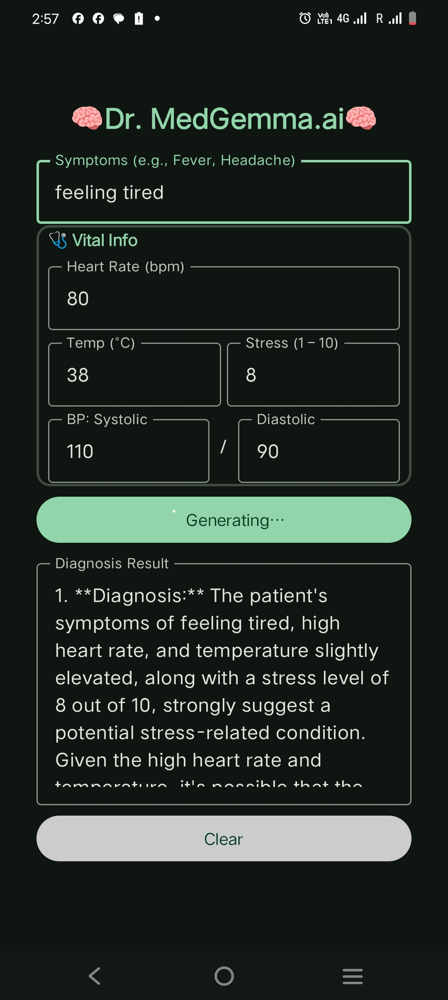

# Dr.MedGemma.ai

## Android appliccation - MedGemma Distilled model integration on Android platform

To integrate MedGemma Distilled model to Androdi, the Pytorch model needs to be converted to a GGUF format using [llama.cpp](https://github.com/ggerganov/llama.cpp)

## this project is forked from  [Kotlin-LlamaCpp](https://github.com/ljcamargo/kotlinllamacpp/) 

The converted .gguf model shoud be put under  **app/src/main/assets/** folder.  
Since gguf model file size is around 900MB, cannot be placed github. 
(Only dummy filed is kept, while buiding the application actual gguf fike

## Environment Setup

You'll need a GGUF model file to before importing this app on Android Studio.

## GGUF Model Creation. 

.gguf modeis generated using Llamma.cpp. (I created evething on Mac Machine)
- Make sure pytrhon version is 3.11 + (python --version  & brew install python@3.11 )
- I built Llama.cpp locally using [LLama.cpp Build](https://github.com/ggml-org/llama.cpp/blob/master/docs/build.md)

    - python3.11 -m venv llama-env
    - source llama-env/bin/activate
    - git clone https://github.com/ggerganov/llama.cpp
    - cd llama.cpp
    - pip3 install -r requirements.txt
    - brew install cmake ( on mac if make is not available)
    - mkdir build && cd build
    - cmake .. -DLLAMA_BUILD_EXAMPLES=ON -DLLAMA_BUILD_TESTS=ON
    - cmake --build . --config Release -j
      
  This will build and make llama.cpp binaries and binaries will be in foldet **"build/bin"**
  
  Here cmake -j can be passed with number of CPU cores available inorder to speed up the buid 

  on Mac  -j$(sysctl -n hw.ncpu)

## generate gguf model using  convert_hf_to_gguf.py
python3 convert_hf_to_gguf.py ../Sensor_distilled_new/ --outfile ../sensor_model.gguf --outtype f16
 - this convert_hf_to_gguf.py convert pytorch  model present in folder "../Sensor_distilled_new/" to "../sensor_model.gguf" in the same folder.
- This "sensor_model.gguf" file needs to be placed in android asset folder.

# For testing the generated .gguf file, we can use llama.cpp cli, which will be there in bin folder
./build/bin/llama-cli  -m ../sensor_model.gguf  -p "Hello, world"

## for quantization use llama-quantize
  ./build/bin/llama-quantize  --allow-requantize ../sensor_model.gguf ../sensor_model_q4_0.gguf q4_0

## Contributing

Contributions are welcome! Please feel free to submit a Pull Request.

## License

MIT

## Acknowledgments

This project builds upon the work of several excellent projects:
- [llama.cpp](https://github.com/ggerganov/llama.cpp) by Georgi Gerganov
- [cui-llama.rn](https://github.com/Vali-98/cui-llama.rn)
- [llama.rn](https://github.com/mybigday/llama.rn)
